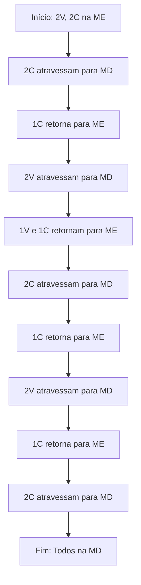

2. Considerando o enunciado a seguir, elabore os passos para resolver o problema com a descrição narrativa e o fluxograma para a questão dos canibais e vegetarianos..
Seja uma região formada por vegetarianos e canibais. Inicialmente, dois vegetarianos e dois canibais estão na margem esquerda (ME) de um rio. Existe um barco que pode transportar no máximo duas pessoas e sempre atravessa o rio com pelo menos uma pessoa. O objetivo é achar uma forma de transportar os dois vegetarianos e os dois canibais para a margem direita (MD) do rio. Em nenhum momento, o número de canibais numa margem do rio pode ser maior que o número de vegetarianos, caso contrário os canibais devoram o vegetariano.

# Resolução lógica:
## Descrição narrativa dos passos

1. Todos começam na margem esquerda (ME): 2 vegetarianos (V) e 2 canibais (C).
2. O barco pode levar 1 ou 2 pessoas por vez.
3. Nunca pode haver mais canibais que vegetarianos em qualquer margem, exceto se não houver vegetarianos.
4. Passos possíveis:

- **Passo 1:** Dois canibais atravessam para a margem direita (MD).  
    Situação: ME: 2V, 0C | MD: 0V, 2C  
- **Passo 2:** Um canibal retorna para a margem esquerda.  
    Situação: ME: 2V, 1C | MD: 0V, 1C  
- **Passo 3:** Dois vegetarianos atravessam para a margem direita.  
    Situação: ME: 0V, 1C | MD: 2V, 1C  
- **Passo 4:** Um vegetariano e um canibal retornam para a margem esquerda.  
    Situação: ME: 1V, 2C | MD: 1V, 1C  
- **Passo 5:** Dois canibais atravessam para a margem direita.  
    Situação: ME: 1V, 0C | MD: 1V, 3C  
- **Passo 6:** Um canibal retorna para a margem esquerda.  
    Situação: ME: 1V, 1C | MD: 1V, 2C  
- **Passo 7:** Dois vegetarianos atravessam para a margem direita.  
    Situação: ME: 0V, 1C | MD: 2V, 2C  
- **Passo 8:** Um canibal retorna para a margem esquerda.  
    Situação: ME: 0V, 2C | MD: 2V, 1C  
- **Passo 9:** Dois canibais atravessam para a margem direita.  
    Situação final: ME: 0V, 0C | MD: 2V, 2C


# Pseudocódigo

```
INÍCIO

    // Definição de variáveis
    
    ESCREVER "Passos para transportar vegetarian
    ESCREVER "1. 2C atravessam para MD"
    ESCREVER "2. 1C retorna para ME"
    ESCREVER "3. 2V atravessam para MD"
    ESCREVER "4. 1V e 1C retornam para ME"
    ESCREVER "5. 2C atravessam para MD"
    ESCREVER "6. 1C retorna para ME"
    ESCREVER "7. 2V atravessam para MD"
    ESCREVER "8. 1C retorna para ME"
    ESCREVER "9. 2C atravessam para MD"
    ESCREVER "Fim: Todos na MD"
    ESCREVER "Todos os vegetarianos e canibais foram transportados com segurança para a margem direita."
FIM
```

# Resultado do teste de mesa

**Todos os vegetarianos e canibais chegaram à margem direita em segurança.**

| Passo | ME (V, C) | MD (V, C) | Barco na |
|-------|-----------|-----------|----------|
| 0     | 2, 2      | 0, 0      | ME       |
| 1     | 2, 0      | 0, 2      | MD       |
| 2     | 2, 1      | 0, 1      | ME       |
| 3     | 0, 1      | 2, 1      | MD       |
| 4     | 1, 2      | 1, 1      | ME       |
| 5     | 1, 0      | 1, 3      | MD       |
| 6     | 1, 1      | 1, 2      | ME       |
| 7     | 0, 1      | 2, 2      | MD       |
| 8     | 0, 2      | 2, 1      | ME       |

## Fluxograma


| 9     | 0, 0      | 2, 2      | MD       |